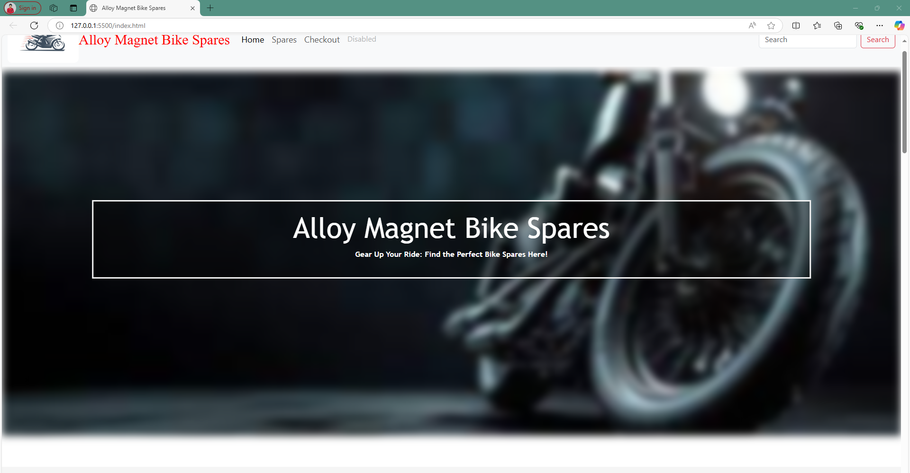
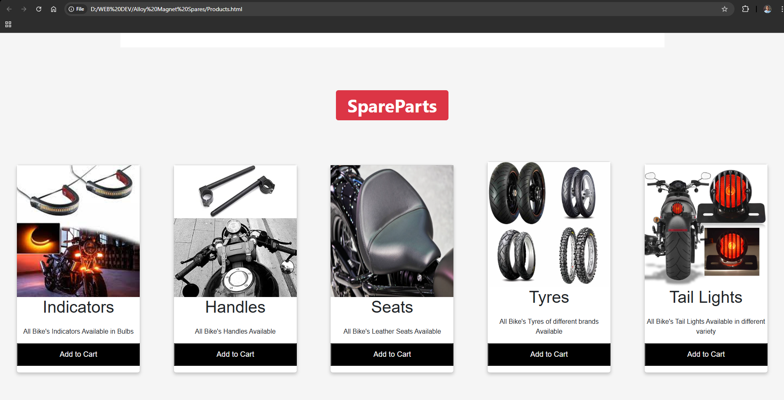
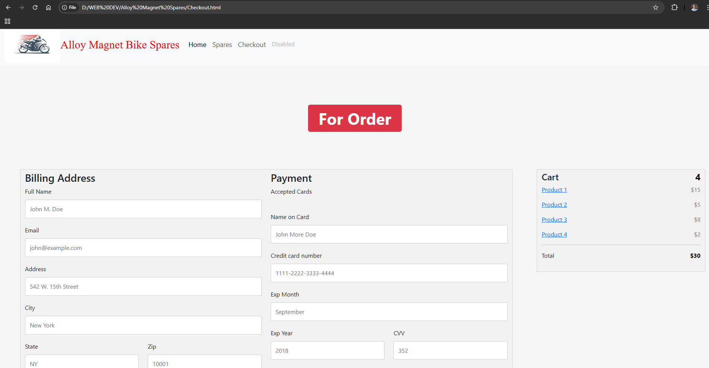

# 🏍Alloy Magnet Bike Spares

Welcome to **Alloy Magnet Bike Spares**, your one-stop destination for high-quality motorcycle spare parts. This website is built using HTML, CSS, and JavaScript, with a modern, responsive design that offers a seamless experience across all devices.

<table>
  <tr>
    <td align="center">
      
       
    </td>
    <td align="center">
      
       
    </td>
  </tr>
  <tr>
    <td align="center">
      
       
    </td>
    <td align="center">
      
       
    </td>
  </tr>
</table>

---

## Features

- **Product Listings**: Wide range of motorcycle spare parts with detailed descriptions and prices.
- **Responsive Design**: Optimized for desktops, tablets, and mobile devices.
- **Search Functionality**: Quickly find the parts you need with an intuitive search bar.
- **User-Friendly Interface**: Modern and clean design for easy navigation.
  
---

## Technologies Used

- **HTML5** for structuring the website.
- **CSS3** for styling and responsive layout.
- **JavaScript (ES6)** for interactive elements and functionality.

---

